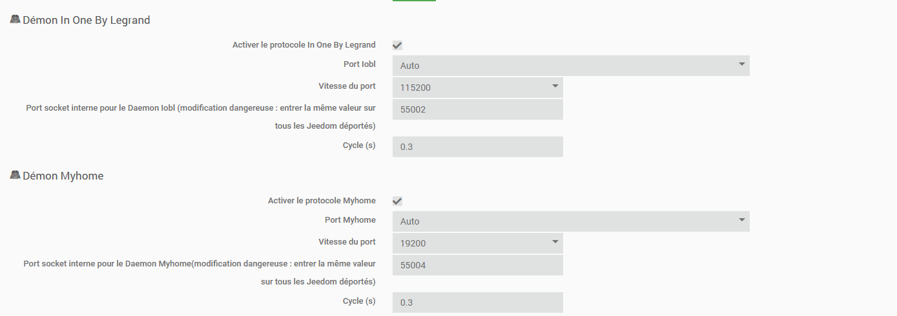
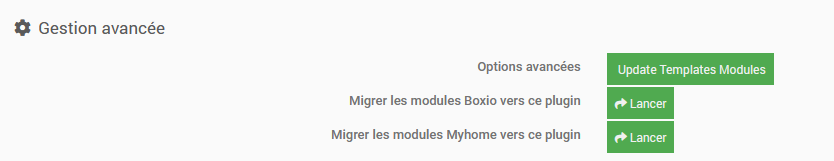
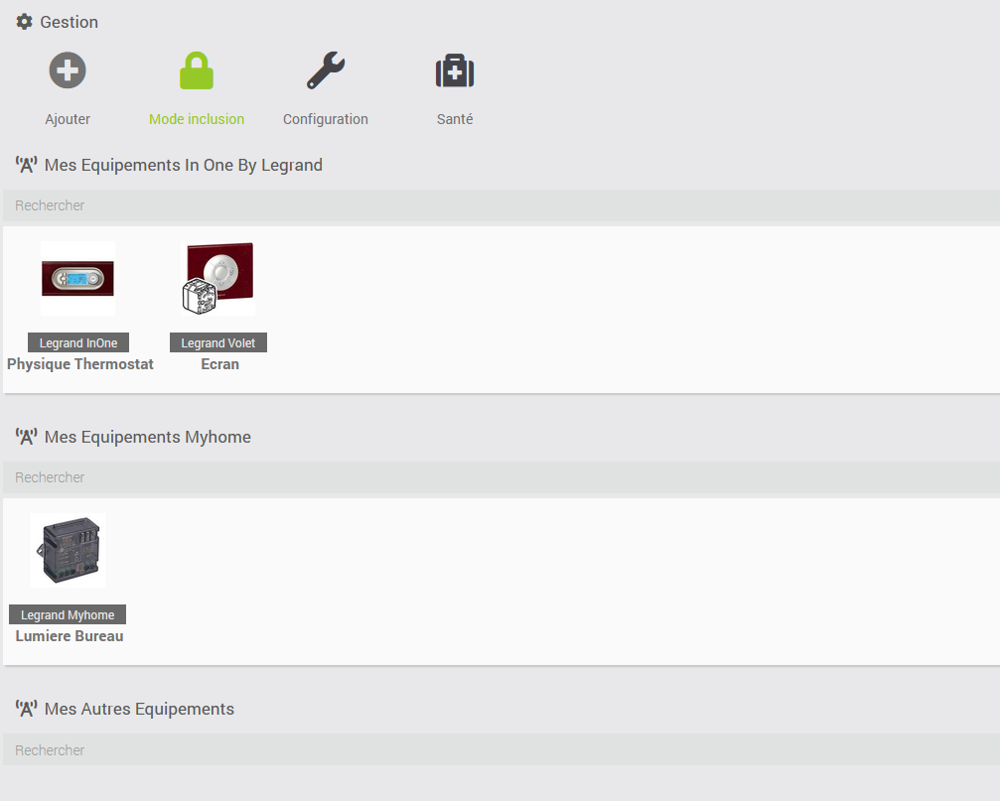
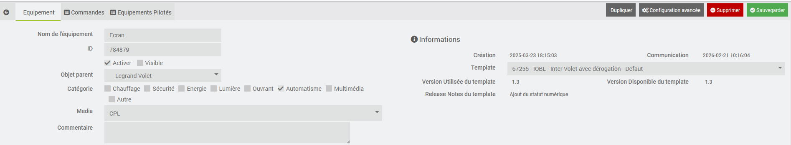
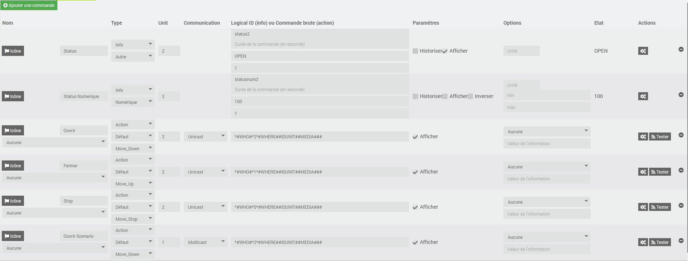
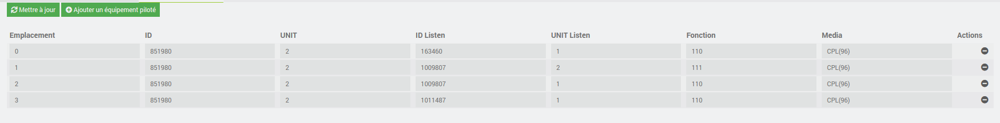

Description
===
Plugin permettant d'utiliser l'adaptateur USB/CPL de Legrand (88213) =>IOBL ou l'adaptateur USB/ZIGBEE de Legrand (88328) ou Bticino (3578) =>MyHOME

Configuration
===
Le plugin permet de dialoguer avec l'ensemble des périphériques In One By Legrand que ce soit en CPL, Radiofréquence ou Infrarouge (pour ces deux derniers, il est nécessaire d'avoir un bridge CPL/IR ou CPL/RF) ou en radio avec le protocol MyHome

Après avoir téléchargé le plugin via le Market, il sera nécessaire de le configurer. Dans la plupart des cas, les paramètres proposés permettent de faire fonctionner le plugin (cf screenshoot ci-dessous). La seule chose à faire est d'activer le/les protocoles que vous souhaitez utiliser. Le changement des paramètres doit être fait en connaissance de cause sans quoi le plugin pourrait ne plus fonctionner

Pour les utilisateurs des anciens plugins (BOXIO ou MyHome), il est possible d'importer les équipements déja configurés dans ce nouveaux plugin. Pour cela, il suffit de se rendre dans la configuration du plugin et utiliser le bouton adéquat de la section Gestion avancée

Dans le cadre d'une nouvelle utilisation, ce reporter à la section ci-dessous : Ajouter un équipement.

Une fois les équipements importés ou créés, nous trouvons dans le menu principal l'ensemble de nos équipements, classés par type de protocole.

si nous cliquons sur un équipement, nous trouvons 3 onglets : Equipement, Commandes et Equipements Pilotés.

L'onglet Equipement permet de choisir le nom de l'équipement, l'identifiant Legrand de l'équipement (son adresse en quelques sorte), la possibilité de rendre inactif le module dans Jeedom, ou encore de rendre visible ou invisible l'équipement dans l'interface, sa destination dans l'arborescence de sa domotique, la catégorie du module (dans le jargon Legrand : WHO), le type de média : pour IOBL, nous avons :CPL, IR ou RF, pour MyHome, il s'agit du media ZIGBEE et enfin le template utilisé ou a affecter à cet équipement. Le template permet de créer automatiquement les commandes necessaire à l'utilisation de ce module dans Jeedom

L'onglet Commandes détail l'ensemble des commandes, d'ajouter ou supprimer ses commandes qui permet d'interragir avec le module. Sans rentrer dans le détail du protocol Legrand, les commandes sont sous la forme WHO, WHAT, WHERE

Le champ type permet de choisir entre une commande de type action ou une commande de type info, le type de l'action ou de l'info (Action, curseur, message, etc...) et l'action (Move Down, Move Up, etc...).
Le champ unit Legrand permet de saisir l'unit (la sous adresse) utilisée pour la commande ou pour le retour d'état.
Le champ communication permet de choisir le type de communication (Multicast, Unicast ou Broadcast).
Le champ LogicalID ou commande brute permet de nommer l'info ou de renseigner la trame "brute".

Globalement, les commandes sont automatiquement remplies si on choisit le bon template et permet donc de s'affranchir de la connaissant du protocole Legrand. 

Enfin l'onglet Equipements Pilotés est utilisé dans le protocole Iobl et reprend le mode de fonctionnement natif aux modules Legrand des Scenario. Dans ces équipements, il est possible d'associer plusieurs équipements entre eux et ainsi commander plusieurs équipements depuis un seul. Par exemple, un interrupteur de volet pilote l'ensemble des volets d'une zone ou une commande générale, permet d'eteindre toute les lumières.
Cet onglet reprend ce concept. Il est possible de récupérer les scenario deja en mémoire dans le module, via le bouton Mettre à jour, mais il est aussi possible de rajouter un équipement piloté manuellement. Pour cela il faut un peu connaitre le fonctionnement du module:

le premier Unit permet de renseigner l'ID de la commande qui servira de commande principal. ID et l'Unit Listen sert a renseigner l'équipement et la commande esclave. La fonction est une notion legrand et peut etre par exemple :

Pour un bouton de volet
===
-    110 : MOVE_UP
-    111 : MOVE_DOWN
-    112 : STOP
  
Pour un interrupteur de lumière
===
-    101 : ON
-    102 : OFF

Il est aussi possible de supprimer un equipement esclave en cliquant sur le "-" en face de l'equipement que l'ont souhaite supprimer de la programmation

Liste des références comaptible avec le plugin
===
L'ensemble des références prisent en charge à date par le plugin est visible dans le menu deroulant des templates

Ajouter un Equipement
===

La plupart des équipements sont rajoutés dans le plugin LegrandIoblMyhome dès qu'ils sont détectés par le module USB/CPL ou MyHome

Une fois l'équipement créé dans le plugin, deux solutions s'offrent à vous. 

Soit l'équipement existe dans le menu déroulant Template et là il suffit de le choisir (si le plugin ne l'a pas déja fait pour vous), puis de faire sauvegarder pour que les commandes soit automatiquement ajoutées.

Soit le module n'existe pas (encore) dans le plugin et alors il vous faudra créer les commandes une à une.

Les commandes info sont nécessaires pour récupérer l'état de l'équipement. Exemple pour les modules 67255, une info "Status" est créée et permet  de connaitre l'état du bouton de l'équipement (appui sur move_up, sur move_down ou sur stop). Cette info permet notamment de gérer les widgets ou est utilisée pour le déclenchement de scénarios

Les commandes actions permettent d'effectuer des actions sur l’équipement. En fonction de la catégorie de l'équipement, vous aurez différents choix.

Les trames Legrand s'orientent autour de 3 variables et sont sous la forme (pour une trame de type BUS-COMMAND) *WHO *WHAT *WHERE##

Le WHO correspond à la catégorie (lumière, automatisme, etc…). Si dans la trame brute vous saisissez \#WHO\#, celle-ci sera remplacée par l'ID de la catégorie de l’équipement.

Le WHAT correspond à l'ID de l'action. Si vous saisissez \#WHAT\#, cette variable sera remplacée par le code correspondant de la commande choisie.

Enfin, le WHERE correspond à la concaténation du mode de communication (unicast, multicast, broadcast), de l'ID+UNIT et du media(CPL, RF, IR). Dans le plugin, vous pouvez saisir \#WHERE# qui sera remplacé par le code correspondant au type de communication choisi et vous pouvez saisir \#IDUNIT# qui sera remplacé par la somme de l'ID du module multiplié par 16 et de son UNIT.

En gros, cela donne \*\#WHO\#\*\#WHAT\#*\#WHERE\#\#IDUNIT\###

En dehors de ces variables, vous pouvez saisir la trame brute directement, par exemple : \*2*2*\#12131413##

Pour connaitre tous les types de trames, valeur WHO, WHAT, WHERE, les types de communication ou les codes media, vous pouvez vous reporter au document Legrand : Open-Nitoo Specifications 

Une fois que vous avez créé toutes les commandes de votre équipement, il est possible de créer un fichier "Equipement" au format JSON. Pour cela, vous pouvez vous inspirer des modules existants.

Ensuite vous pourrez le partager avec la communauté en me transmettant le fichier JSON ou les commandes brut via le forum jeedom communautaire.

Merci à vous.

Depannage et diagnostic
===

Le deamon refuse de démarrer
-----------------------------

Essayer de le démarrer en mode debug pour voir l'erreur

Lors du démarrage en mode debug j'ai une erreur avec : /tmp/boxiocmd.pid
-------------------------------------------------------------------------

Attendez une minute pour voir si le problème persiste, si c'est le cas en ssh faites : "sudo rm /tmp/boxiocmd.pid"

Lors du démarrage en mode debug j'ai : can not start server socket, another instance alreay running
----------------------------------------------------------------------------------------------------

Cela veut dire que le deamon est démarré mais que Jeedom n'arrive pas à le stopper. Vous pouvez soit redémarrer tout le système, soit en ssh faire "killall -9 LegrandIoblMyhomed.py"

Mes équipements ne sont pas vus
-------------------------------

Assurez-vous d'avoir bien coché cliqué sur le bouton inclusion, vérifiez que le deamon est bien démarré. Vous pouvez aussi le redémarrer en debug pour voir s'il reçoit bien les messages de vos équipements
